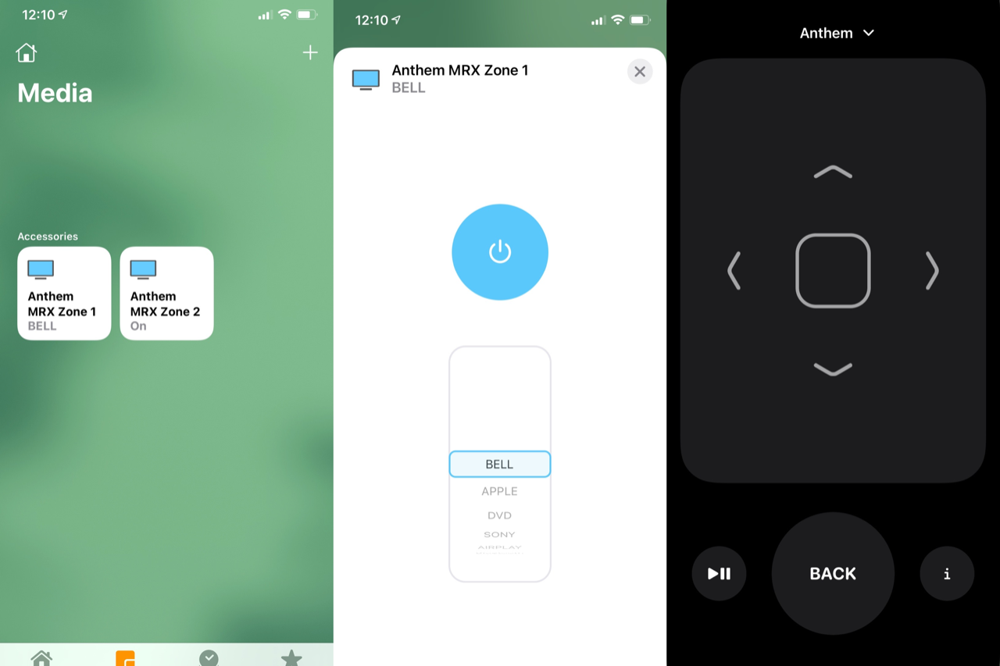

# homebridge-anthemreceiver

Homebridge Power and Input accessory for Anthem AV Receiver. By default, the plugin will create one accessory for each zone on the receiver. 



# Supported models

- AVM 60,  AVM 70,  AVM 90 (Needs testing)
- MRX 310, MRX 510, MRX 710 (Needs testing)
- MRX 520, MRX 720, MRX 1120 (Tested)
- MRX 540, MRX 740, MRX 1140 (Tested)

# Getting started

- Install Homebridge
- Enable Connected Standby option on receiver (System setup -> General -> General Setting)
- Installl homebridge-anthemreceiver plugin
- Configure by filling config.json or using Homebridge UI
- Restart Homebridge server
- Accessory is configured as an external accessory. It needs to be added manually afterward in Home app. See procedure below. 

# Configuration options

* `Host`: IP address or hostname of Anthem receiver
* `Port`: Default to 14999, use value set up in receiver

Zone1 and Zone2 options:
- Active: Show or hide accessory in Home App.
- Name: Accessory name in Home App. 

```
{
    "platform": "AnthemReceiver",
    "Host": "192.168.1.1",
    "Port": 14999,
    "Zone1": {
        "Active": true,
        "Name": "Zone1"
    },
    "Zone2": {
        "Active": true,
        "Name": "Zone2"
    }   
}
```

# Adding accessory to Home App
## iOS 15
- Open Home App
- Select "+" on the right upper corner of the screen and select "Add Accessory"
- Select "More options"
- Select unconfigured accessory to be added.
- Follow further on screen instructions to complete configuration

# Apple Remote in Control Center
* UP and DOWN physical volume buttons to change volume
* UP and DOWN to change volume
* PLAY AND PAUSE to toggle mute
* LEFT, RIGHT to select input (Main Zone)
* BACK button to toggle audio listening mode (Main Zone)
* INFO button to show and hide menu display (Main Zone)
* CENTER button so select option (Main Zone)

# Releases
## 0.4.0
* No changes to configuration file options.
* Controller now gracefully reconnect to receiver on connection lost or timeout without crashing the pluglin.
* Better handling of different series protocol: X10, X20 and X40.
* Only able to test with MRX740. Please report success running the plugin on your model on Github project issues page (v0.4.0 Support thread).  

# Known issues
- Zone needs to be powered off and on if inputs are added or removed on the receiver for changes to appear in Homekit. For the moment, if inputs are not visible under Television Accessory, please kill and reopen Home App. 