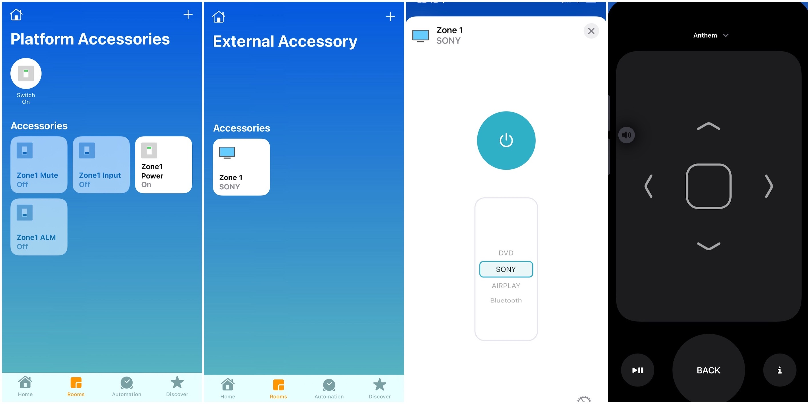

# homebridge-anthemreceiver
Homebridge plugin for Anthem AV Receiver.
- Zone 1 and Zone 2 Power/Input accessories (External television accessories to be manually added in Home App)
- Zone 1 and Zone 2 Power, Mute and Input accessories
- Zone 1 Audio Listenning Mode accessory



# Supported models
- AVM 60,  AVM 70,  AVM 90 (Needs testing)
- MRX 310, MRX 510, MRX 710 (Needs testing)
- MRX 520, MRX 720, MRX 1120 (Tested)
- MRX 540, MRX 740, MRX 1140 (Tested)

# Getting started
- Install Homebridge
- Install homebridge-anthemreceiver plugin
- Enable Connected Standby option on Anthem Receiver (Web UI: System setup -> General -> General Setting)
- Configure plugin by filling config.json or using Homebridge UI interface
- Restart Homebridge server
- Power, Mute, Input and Audio Listenning Mode accessories will be add automatically if enabled. 
- Power/Input accessories are to be manually added in Home App. This step is needed for Apple Remote to be present in control center. See procedure below.

# Configuration options
* `Host`: IP address or hostname of Anthem receiver
* `Port`: Default to 14999, use value set up in receiver
* `Active`: Publish Zone External Power/Input accessory 
* `Name`: Zone External Power/Input accessory custom name. Defaults to "Zone1" and "Zone2"
* `Power`: Add Zone Power accessory (Toggle Zone on and off status)
* `Mute`: Add Zone Mute accessory (Toggle Zone mute status)
* `Input`: Add Zone Input accessory (Cycle Zone active input)
* `ALM`: Add Zone1 Audio Listenning Mode accessory (Cycle Zone1 Current Audio Mode)

```
{
    "Host": "192.168.10.78",
    "Port": 14999,
    "Zone1": {
        "Active": true,
        "Name": "Zone 1",
        "Power": true,
        "Mute": true,
        "Input": true,
        "ALM": true
    },
    "Zone2": {
        "Active": true,
        "Name": "Zone 2",
        "Power": true,
        "Input": true,
        "Mute": true
    },
    "platform": "AnthemReceiver"
}
```

# Adding External Power/Input accessory in Home App
## iOS 15
- Enable "Power/Input" accessory in config file or Homebridge UI. Restart Homebridge after any modifications
- Open Home App
- Select "+" on the right upper corner of the screen and select "Add Accessory"
- Select "More options"
- Select "Zone1" or "Zone2" Power/Input Television accessory
- Follow further on screen instructions to complete configuration

# Apple Remote in Control Center
* Device UP and DOWN physical volume buttons to change volume
* UP and DOWN to change volume
* PLAY AND PAUSE to toggle mute
* LEFT, RIGHT to select input (Main Zone)
* BACK button to switch curent audio mode (Main Zone)
* INFO button to show and hide menu display (Main Zone)
* CENTER button so select option (Main Zone)

# Releases
## 0.5.0
- Adding Power, Mute and Input accessories for Zone1 and Zone2
- Adding Audio Listening mode accessory for Zone1

## 0.4.0
* No changes to configuration file options.
* Controller now gracefully reconnect to receiver on connection lost or timeout without crashing the plugin.
* Better handling of different series protocol: X10, X20 and X40.
* Only able to test with MRX740. Please report success running the plugin on your model on Github project issues page (v0.4.0 Support thread).  

# Known issues
- Zone needs to be powered off and on if inputs are added or removed on the receiver for changes to appear in Homekit. For the moment, if inputs are not visible under Television Accessory, please kill and reopen Home App. 
- It takes a few seconds for the receiver to become responsive to HomeKit commands even if the receiver reports being powered on. 